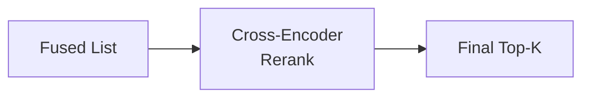

# Reranking (Cloud, Local, Learning)

<div class="grid chunk_summaries" markdown>

-   :material-sort-variant:{ .lg .middle } **Reorder Candidates**

    ---

    Cross-encoders refine fused candidates for precision.

-   :material-chip:{ .lg .middle } **Local or Cloud**

    ---

    Use open-source cross-encoders locally or Cohere/Voyage/Jina via API.

-   :material-school:{ .lg .middle } **Learning Reranker**

    ---

    Mine triplets and fine-tune a task-specific reranker.

</div>

[Get started](index.md){ .md-button .md-button--primary }
[Configuration](configuration.md){ .md-button }
[API](api.md){ .md-button }

!!! tip "Balanced TopN"
    Use `tribrid_reranker_topn=40..60` for quality vs latency.

!!! note "Cloud Limits"
    Respect provider token limits and per-request pricing; tune `reranker_cloud_top_n` accordingly.

!!! warning "Trust Remote Code"
    `transformers_trust_remote_code=1` executes model repo code. Only enable for trusted models.

## Modes and Fields

| Field | Meaning |
|-------|---------|
| `reranking.reranker_mode` | `none` \| `local` \| `learning` \| `cloud` |
| `reranking.reranker_local_model` | HF model or local path |
| `reranking.reranker_cloud_provider` | `cohere` \| `voyage` \| `jina` |
| `reranking.reranker_cloud_model` | Provider-scoped model id |
| `reranking.tribrid_reranker_topn` | Candidates to rerank |
| `reranking.reranker_timeout` | Timeout for API calls |

### Example: Enable Weighted Fusion + Local Rerank

=== "Python"
```python
import httpx
base = "http://localhost:8000"
httpx.patch(f"{base}/config/fusion", json={"method":"weighted","vector_weight":0.4,"sparse_weight":0.3,"graph_weight":0.3}).raise_for_status()
httpx.patch(f"{base}/config/reranking", json={"reranker_mode":"local","reranker_local_model":"cross-encoder/ms-marco-MiniLM-L-12-v2","tribrid_reranker_topn":50}).raise_for_status()
```

=== "curl"
```bash
BASE=http://localhost:8000
curl -sS -X PATCH "$BASE/config/fusion" -H 'Content-Type: application/json' -d '{"method":"weighted","vector_weight":0.4,"sparse_weight":0.3,"graph_weight":0.3}' | jq .
curl -sS -X PATCH "$BASE/config/reranking" -H 'Content-Type: application/json' -d '{"reranker_mode":"local","reranker_local_model":"cross-encoder/ms-marco-MiniLM-L-12-v2","tribrid_reranker_topn":50}' | jq .
```

=== "TypeScript"
```typescript
await fetch('/config/fusion', { method:'PATCH', headers:{'Content-Type':'application/json'}, body: JSON.stringify({ method:'weighted', vector_weight:0.4, sparse_weight:0.3, graph_weight:0.3 }) });
await fetch('/config/reranking', { method:'PATCH', headers:{'Content-Type':'application/json'}, body: JSON.stringify({ reranker_mode:'local', reranker_local_model:'cross-encoder/ms-marco-MiniLM-L-12-v2', tribrid_reranker_topn:50 }) });
```



??? info "Learning Reranker"
    Use `/reranker/mine`, `/reranker/train/start`, `/reranker/train/run/stream` to build a corpus-specific reranker. See API docs for streaming metrics and diffing runs.
