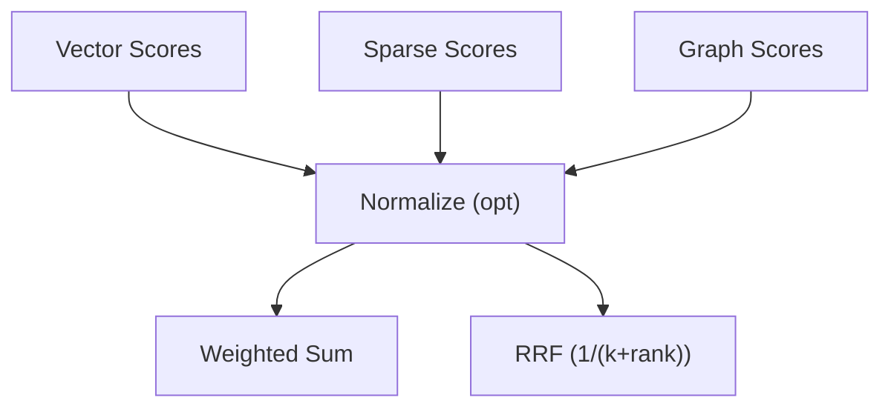

# Fusion Details

<div class="grid chunk_summaries" markdown>

-   :material-shuffle-variant:{ .lg .middle } **Weighted Fusion**

    ---

    Linear combination of normalized scores with interpretable weights.

-   :material-function-variant:{ .lg .middle } **Reciprocal Rank Fusion**

    ---

    Rank-based fusion robust to heterogeneous score distributions.

-   :material-scale-balance:{ .lg .middle } **Normalization**

    ---

    Optional score normalization per leg before fusion.

</div>

[Get started](../index.md){ .md-button .md-button--primary }
[Configuration](../configuration.md){ .md-button }
[API](../api.md){ .md-button }

!!! tip "Start with RRF"
    RRF is often robust without per-leg calibration. Switch to `weighted` once you have stable score distributions and want more control.

!!! note "Weights Sum"
    Pydantic validators normalize tri-brid weights to sum to 1.0.

!!! warning "Mismatched Scales"
    If you use `weighted`, enable `fusion.normalize_scores` unless all legs produce comparable scales.

## Configuration

| Field | Type | Default | Description |
|------|------|---------|-------------|
| `fusion.method` | Literal | `rrf` | `rrf | weighted` |
| `fusion.vector_weight` | float | 0.4 | Vector contribution |
| `fusion.sparse_weight` | float | 0.3 | Sparse contribution |
| `fusion.graph_weight` | float | 0.3 | Graph contribution |
| `fusion.rrf_k` | int | 60 | RRF smoothing constant |
| `fusion.normalize_scores` | bool | true | Normalize per-leg scores |



## Annotated Implementation Sketch

=== "Python"
```python
def fuse(vector, sparse, graph, cfg):  # (1)
    if cfg.fusion.method == "rrf":
        return rrf_fusion(vector, sparse, graph, k=cfg.fusion.rrf_k)  # (2)
    else:
        if cfg.fusion.normalize_scores:
            vector, sparse, graph = map(normalize01, (vector, sparse, graph))  # (3)
        return weighted(vector, sparse, graph, (cfg.fusion.vector_weight, cfg.fusion.sparse_weight, cfg.fusion.graph_weight))  # (4)
```

=== "curl"
```bash
# Fusion is server-controlled via config; no direct curl
```

=== "TypeScript"
```typescript
// Client impacts fusion by PATCH /config/fusion
```

1. Inputs are per-leg result lists with scores
2. RRF uses ranks only; tune `rrf_k`
3. Optional normalization improves comparability
4. Weighted sum uses tri-brid weights (sum to ~1)
