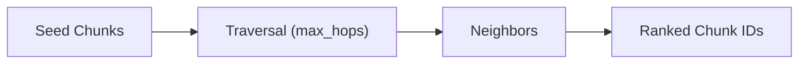

# Graph Retrieval and Storage

<div class="grid chunk_summaries" markdown>

-   :material-graph:{ .lg .middle } **Graph Storage**

    ---

    Neo4j stores entities/relationships; per-corpus isolation via database selection.

-   :material-route:{ .lg .middle } **Traversal**

    ---

    Expand from seeds with `max_hops`, optionally adding neighbor context.

-   :material-cog-sync:{ .lg .middle } **Indexing Hooks**

    ---

    Build lexical graph, store chunk embeddings, and (optionally) semantic KG.

</div>

[Get started](../index.md){ .md-button .md-button--primary }
[Configuration](../configuration.md){ .md-button }
[API](../api.md){ .md-button }

!!! tip "Chunk Mode"
    The `graph_search.mode="chunk"` blends lexical adjacency with entity expansion for practical cross-file context.

!!! note "Per-Corpus Database"
    Use `graph_storage.neo4j_database_mode="per_corpus"` (Neo4j Enterprise) for hard isolation.

!!! warning "Vector Index"
    If you store chunk embeddings in Neo4j, ensure the vector index comes ONLINE before serving traffic.

## Search Configuration (Selected)

| Field | Default | Description |
|-------|---------|-------------|
| `graph_search.enabled` | true | Enable graph leg |
| `graph_search.max_hops` | 2 | Traversal depth |
| `graph_search.top_k` | 30 | Hits from traversal |
| `graph_search.chunk_neighbor_window` | 1 | Include adjacent chunks |
| `graph_search.chunk_entity_expansion_enabled` | true | Expand via entity links |

## Storage Configuration (Selected)

| Field | Default | Description |
|-------|---------|-------------|
| `graph_storage.neo4j_uri` | `bolt://localhost:7687` | Connection URI |
| `graph_storage.neo4j_user` | `neo4j` | Username |
| `graph_storage.neo4j_password` | — | Password |
| `graph_storage.max_hops` | 2 | Default traversal bound |
| `graph_indexing.store_chunk_embeddings` | true | Store chunk vectors on nodes |
| `graph_indexing.chunk_vector_index_name` | `tribrid_chunk_embeddings` | Vector index name |



=== "Python"
```python
import httpx
base = "http://localhost:8000"
entities = httpx.get(f"{base}/graph/tribrid/entities").json()
first = entities[0]
rels = httpx.get(f"{base}/graph/tribrid/entity/{first['entity_id']}/neighbors").json()
print(first['name'], len(rels.get('relationships', [])))
```

=== "curl"
```bash
BASE=http://localhost:8000
curl -sS "$BASE/graph/tribrid/entities" | jq '.[0]'
```

=== "TypeScript"
```typescript
async function neighbors(corpus: string) {
  const ents = await (await fetch(`/graph/${corpus}/entities`)).json();
  const id = ents[0].entity_id;
  const rels = await (await fetch(`/graph/${corpus}/entity/${id}/neighbors`)).json();
  console.log(id, rels.relationships.length);
}
```
