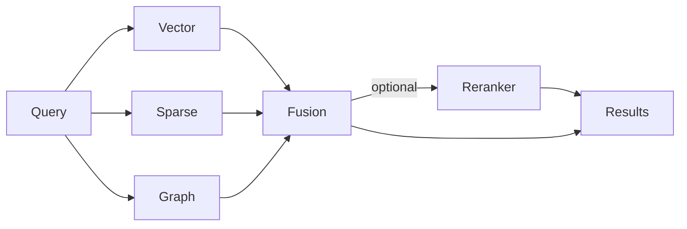
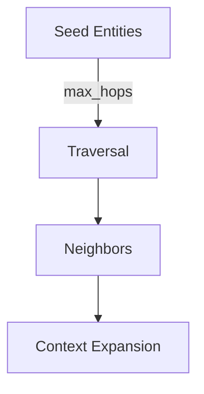

# Retrieval Overview

<div class="grid chunk_summaries" markdown>

-   :material-magnify:{ .lg .middle } **Vector Search**

    ---

    pgvector similarity over chunk embeddings with configurable distance metrics and indexes.

-   :material-format-quote-close:{ .lg .middle } **Sparse Search**

    ---

    PostgreSQL FTS/BM25 for exact tokens, identifiers, and literals.

-   :material-graph:{ .lg .middle } **Graph Search**

    ---

    Neo4j traversal to expand entity neighborhoods and follow relationships across files.

-   :material-shuffle-variant:{ .lg .middle } **Fusion**

    ---

    Weighted or RRF; per-retriever contributions logged for analysis.

-   :material-swap-vertical:{ .lg .middle } **Optional Reranker**

    ---

    Cross-encoder rescoring of fused candidates for precision.

</div>

[Get started](../index.md){ .md-button .md-button--primary }
[Configuration](../configuration.md){ .md-button }
[API](../api.md){ .md-button }

!!! tip "Pro Tip — Balance Recall and Precision"
    Increase top_k per retriever to maximize recall. Use fusion weights and reranking to regain precision.

!!! note "Isolation by Corpus"
    Each corpus has isolated storage and graph. Queries always require `corpus_id`.

!!! warning "Latency Budget"
    Graph expansion can increase latency with large hop counts. Use `max_hops` conservatively and cache frequent queries.

## Control Surface

| Retriever | Key Fields | Defaults |
|-----------|------------|----------|
| Vector | `retrieval.vector.top_k`, `distance_metric`, `min_score` | Top_k 8–20 |
| Sparse | `retrieval.sparse.top_k`, `use_bm25`, `tsquery_mode` | BM25 enabled |
| Graph | `retrieval.graph.max_hops`, `edge_types`, `expand_neighbors` | 1–2 hops |
| Fusion | `fusion.strategy`, `fusion.weights`, `fusion.rrf_k_div` | weighted + tuned weights |
| Reranker | `reranker.enabled`, `reranker.model`, `batch_size` | disabled |



## Programmatic Search

=== "Python"
    ```python
    import httpx

    BASE = "http://localhost:8000"
    body = {
      "corpus_id": "tribrid",
      "query": "How are pgvector indexes created?",
      "top_k": 10,
      "enable_reranker": True,
      "filters": {"path_prefix": "server/db"}  # optional impl-specific filter
    }
    res = httpx.post(f"{BASE}/search", json=body).json() # (1)
    for r in res["results"]:
        # includes per-source scores e.g., r["sources"]["vector"], r["sources"]["sparse"]
        print(r["file_path"], r["score"]) # (2)
    ```

=== "curl"
    ```bash
    curl -sS -X POST http://localhost:8000/search \
      -H 'Content-Type: application/json' \
      -d '{
        "corpus_id": "tribrid",
        "query": "pgvector index",
        "top_k": 10,
        "enable_reranker": true
      }' | jq '.results[0]'
    ```

=== "TypeScript"
    ```typescript
    import { SearchRequest, SearchResponse } from "../web/src/types/generated";

    async function run(req: SearchRequest): Promise<SearchResponse> {
      const r = await fetch("/search", { method: "POST", headers: {"Content-Type":"application/json"}, body: JSON.stringify(req) });
      return await r.json();
    }
    ```

1. Search executes all retrievers concurrently
2. `score` is fused; provenance retained per source

!!! success "Auditable Fusion"
    Each match returns provenance: which retriever(s) contributed and their raw scores. This is essential for debugging.

### Fusion Strategies

| Strategy | Math | Notes |
|----------|------|-------|
| weighted | `w_v*sv + w_s*ss + w_g*sg` | Default; interpretable weights |
| rrf | `1/(k + rank)` per source, summed | Robust across heterogeneous scores |

### Graph Expansion

| Field | Effect |
|-------|--------|
| `max_hops` | Traversal depth; controls neighborhood growth |
| `edge_types` | Restrict to safe/meaningful relations |
| `expand_neighbors` | Add 1-hop context chunks to results |



- [x] Tune per-retriever `top_k`
- [x] Choose `weighted` or `rrf`
- [x] Enable reranking once recall is strong

??? note "Caching"
    The retrieval cache stores fused results keyed by `corpus_id`, `query`, and a hash of the retrieval config segment. Invalidate on config changes or reindex.
