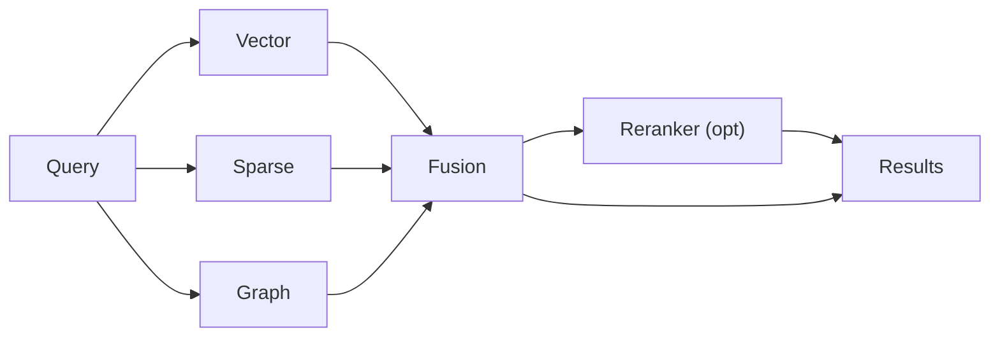

# Retrieval Overview

<div class="grid chunk_summaries" markdown>

-   :material-magnify:{ .lg .middle } **Vector Search**

    ---

    pgvector similarity over chunk embeddings with configurable Top-K.

-   :material-format-quote-close:{ .lg .middle } **Sparse Search**

    ---

    PostgreSQL FTS/BM25 for exact tokens, identifiers, and literals.

-   :material-graph:{ .lg .middle } **Graph Search**

    ---

    Neo4j traversal to expand neighborhoods and follow relationships across files.

-   :material-shuffle-variant:{ .lg .middle } **Fusion**

    ---

    Weighted or RRF; per-retriever contributions tracked for analysis.

-   :material-swap-vertical:{ .lg .middle } **Optional Reranker**

    ---

    Local/cloud/learning reranker rescoring of fused candidates for precision.

</div>

[Get started](../index.md){ .md-button .md-button--primary }
[Configuration](../configuration.md){ .md-button }
[API](../api.md){ .md-button }

!!! tip "Balance Recall and Precision"
    Increase per-leg Top-K to maximize recall; use fusion weights and reranking to restore precision.

!!! note "Isolation by Corpus"
    Each corpus has isolated storage and graph. Queries always require `corpus_id`.

!!! warning "Latency Budget"
    Graph traversal increases latency with larger hop counts. Use `max_hops` conservatively.

## Control Surface (Selected)

| Retriever | Key Fields | Defaults |
|-----------|------------|----------|
| Vector | `vector_search.enabled`, `vector_search.top_k` | 50 |
| Sparse | `sparse_search.enabled`, `sparse_search.top_k`, `sparse_search.bm25_k1`, `sparse_search.bm25_b` | 50 / 1.2 / 0.4 |
| Graph | `graph_search.enabled`, `graph_search.max_hops`, `graph_search.top_k` | true / 2 / 30 |
| Fusion | `fusion.method`, `fusion.rrf_k`, `fusion.*_weight` | rrf / 60 |
| Reranker | `reranking.reranker_mode`, `tribrid_reranker_topn` | local / 50 |



## Programmatic Search

=== "Python"
```python
import httpx
BASE = "http://localhost:8000"
body = {"corpus_id": "tribrid", "query": "How are pgvector indexes created?", "top_k": 10}
res = httpx.post(f"{BASE}/search", json=body).json()  # (1)
for r in res.get("matches", []):
    print(r["file_path"], r["score"])  # fused score (2)
```

=== "curl"
```bash
curl -sS -X POST http://localhost:8000/search \
  -H 'Content-Type: application/json' \
  -d '{"corpus_id":"tribrid","query":"pgvector index","top_k":10}' | jq '.matches[0]'
```

=== "TypeScript"
```typescript
import type { SearchRequest, SearchResponse } from "../../web/src/types/generated";

async function run(req: SearchRequest): Promise<SearchResponse> {
  const r = await fetch("/search", { method: "POST", headers: {"Content-Type":"application/json"}, body: JSON.stringify(req) });
  return await r.json();
}
```

1. Search executes all retrievers concurrently
2. `score` is fused; provenance retained in each `ChunkMatch.source`

!!! success "Auditable Fusion"
    `SearchResponse.debug` can include per-leg diagnostics when enabled.

??? note "Caching"
    Retrieval cache keys include `corpus_id`, `query`, and a hash of relevant retrieval config. Invalidate on config change or reindex.
