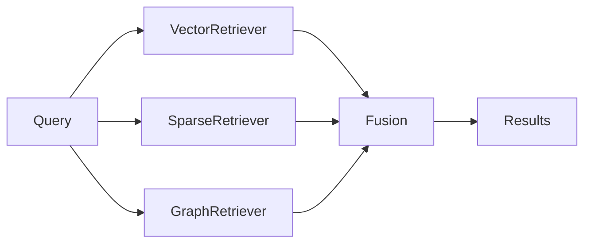
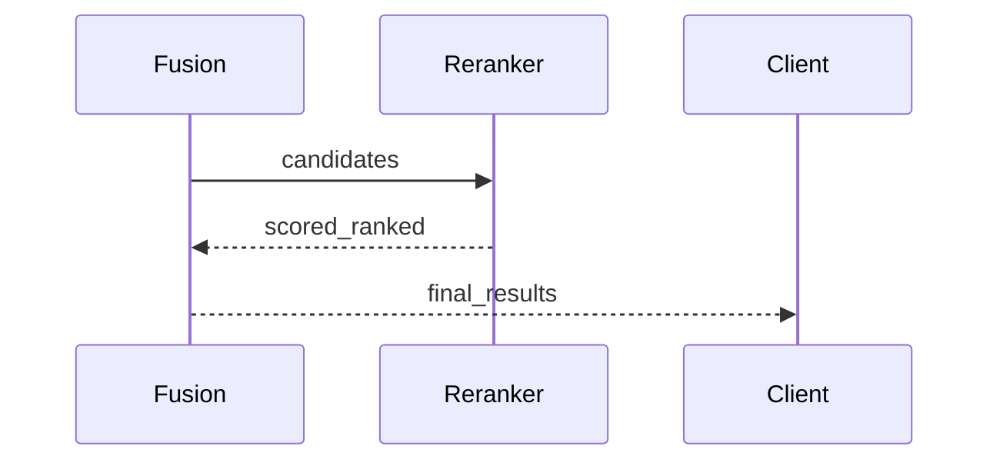

<div class="grid chunk_summaries" markdown>

-   :material-magnify:{ .lg .middle } **Vector Search (pgvector)**

    ---

    Semantic similarity using stored embeddings

-   :material-magnify:{ .lg .middle } **Sparse Search (FTS/BM25)**

    ---

    Exact matches and identifier lookup via Postgres FTS

-   :material-graph:{ .lg .middle } **Graph Search (Neo4j)**

    ---

    Entity traversal, community context, and hops-based expansion

</div>

!!! tip "Pro Tip"
    Use vector search for conceptual queries and sparse search for code identifiers or exact phrases.

!!! note "Implementation Note"
    TriBridFusion orchestrates parallel calls to VectorRetriever, SparseRetriever, and GraphRetriever.

!!! warning "Performance Warning"
    Large corpora may need Postgres and Neo4j tuning. Adjust PG connection pools and Neo4j heap sizes in environment.

??? note "Collapsible: Retrieval quick facts"

    - Fusion runs the three retrievers in parallel and merges results by configurable weights
    - Reranking is optional and controlled by the reranker configuration


## Retriever responsibilities

| Retriever | Purpose | Primary file |
|-----------|---------|--------------|
| Vector | Semantic similarity via pgvector | server/retrieval/vector.py |
| Sparse | BM25 & FTS for precise matching | server/retrieval/sparse.py |
| Graph | Context expansion via Neo4j traversal | server/retrieval/graph.py |





=== "Python"
    ```python
    def fusion_search(query: str, repo_id: str): # (1)
        # (2) Run retrievers in parallel
        vector_task = vector.search(query, repo_id)
        sparse_task = sparse.search(query, repo_id)
        graph_task = graph.search(query, repo_id)
        # (3) fusion merges results
        fused = fusion.fuse([vector_task, sparse_task, graph_task])
        return fused
    ```

=== "curl"
    ```bash
    curl -X POST "http://localhost:8000/search" \
      -H "Content-Type: application/json" \
      -d '{"query":"init db connection","repo_id":"my_corpus"}'
    ```

=== "TypeScript"
    ```typescript
    import { SearchResponse } from '../types/generated' // (1)

    async function fetchSearch(query: string, repoId: string): Promise<SearchResponse> { // (2)
      const res = await fetch('/api/search', { method: 'POST', body: JSON.stringify({ query, repo_id: repoId }) })
      return res.json()
    }
    ```


1. Function entry types and contract
2. Parallel retrieval and fusion
3. Optional rerank step occurs after fusion


### Graph expansion patterns

| Strategy | Use case | Config field |
|---------|----------|--------------|
| Max hops | Short context expansion | graph.max_hops |
| Community | Bring related entities | graph.community_min_size |
| Attribute filter | Limit by node label | graph.allowed_labels |


### Reranker

!!! info "Information"
    The reranker (cross-encoder) is an optional component. Training utilities and triplet mining exist under server/retrieval/learning.py and server/api/reranker.py.





- [x] Verify embedding model selection in models.json
- [ ] If using provider embeddings, ensure API keys are set


??? note "Collapsible: Troubleshooting"

    - If vector results are poor: re-embed with updated model or increase chunk context.
    - If sparse fails to find identifiers: regenerate FTS tokenizer or stemmer settings in config.
