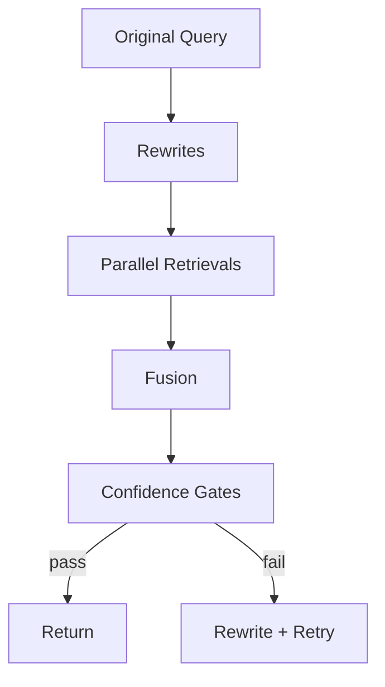

# Query Expansion and Confidence Thresholds

-   :material-creation:{ .lg .middle } **Expansion**

    ---

    Multi-query rewrites and semantic synonyms improve recall.

-   :material-shield-half-full:{ .lg .middle } **Confidence Gates**

    ---

    `conf_top1`, `conf_avg5`, and `conf_any` control retry/fallback behavior.

-   :material-clipboard-text-search:{ .lg .middle } **Eval Alignment**

    ---

    Match eval settings (`eval_multi`, `eval_final_k`) with production.

[Get started](index.md){ .md-button .md-button--primary }
[Configuration](configuration.md){ .md-button }
[API](api.md){ .md-button }

| Field | Default | Description |
|-------|---------|-------------|
| `retrieval.max_query_rewrites` | 2 | LLM rewrites for search |
| `retrieval.multi_query_m` | 4 | Variants per multi-query run |
| `retrieval.use_semantic_synonyms` | 1 | Expand with curated synonyms |
| `retrieval.conf_top1` | 0.62 | Threshold for early-accept top-1 |
| `retrieval.conf_avg5` | 0.55 | Gate for rewrite retries |
| `retrieval.conf_any` | 0.55 | Safety net threshold |

