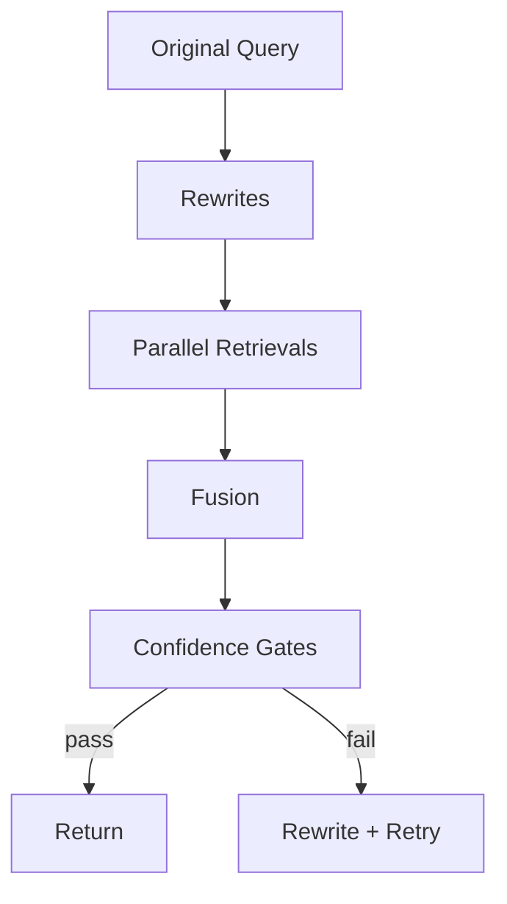

# Query Expansion and Confidence Thresholds

<div class="grid chunk_summaries" markdown>

-   :material-creation:{ .lg .middle } **Expansion**

    ---

    Multi-query rewrites and semantic synonyms improve recall.

-   :material-shield-half-full:{ .lg .middle } **Confidence Gates**

    ---

    `conf_top1`, `conf_avg5`, and `conf_any` control retry/fallback behavior.

-   :material-clipboard-text-search:{ .lg .middle } **Eval Alignment**

    ---

    Match eval settings (`eval_multi`, `eval_final_k`) with production.

</div>

[Get started](index.md){ .md-button .md-button--primary }
[Configuration](configuration.md){ .md-button }
[API](api.md){ .md-button }

!!! tip "Start Simple"
    Begin with 2 rewrites and curated synonyms. Increase only if your evals show recall gaps.

!!! note "Synonyms File"
    `retrieval.tribrid_synonyms_path` points at a JSON mapping terms to arrays of synonyms. Works with `use_semantic_synonyms=1`.

!!! warning "Rewrite Budget"
    Every rewrite costs time (and likely tokens). Balance recall gains with latency budgets.

| Field | Default | Description |
|-------|---------|-------------|
| `retrieval.max_query_rewrites` | 2 | LLM rewrites for search |
| `retrieval.multi_query_m` | 4 | Variants per multi-query run |
| `retrieval.use_semantic_synonyms` | 1 | Expand with curated synonyms |
| `retrieval.conf_top1` | 0.62 | Threshold for early-accept top-1 |
| `retrieval.conf_avg5` | 0.55 | Gate for rewrite retries |
| `retrieval.conf_any` | 0.55 | Safety net threshold |



=== "Python"
```python
import httpx
base = "http://localhost:8000"

settings = {
  "retrieval": {
    "max_query_rewrites": 2,  # (1)!
    "multi_query_m": 4,        # (2)!
    "use_semantic_synonyms": 1 # (3)!
  }
}
httpx.patch(f"{base}/config/retrieval", json=settings["retrieval"]).raise_for_status()
```

1. LLM rewrite budget
2. RRF constant (M) for multi-query fusion
3. Curated synonyms enabled

=== "curl"
```bash
BASE=http://localhost:8000
curl -sS -X PATCH "$BASE/config/retrieval" -H 'Content-Type: application/json' \
  -d '{"max_query_rewrites":2,"multi_query_m":4,"use_semantic_synonyms":1}' | jq .
```

=== "TypeScript"
```typescript
await fetch('/config/retrieval', {
  method: 'PATCH',
  headers: { 'Content-Type': 'application/json' },
  body: JSON.stringify({ max_query_rewrites: 2, multi_query_m: 4, use_semantic_synonyms: 1 }),
});
```

??? info "When to retry"
    - Retry if `avg top-5 < conf_avg5` and rewrite budget remains.
    - Accept immediately if `top-1 >= conf_top1`.
    - Proceed if any result above `conf_any` when others fail.
