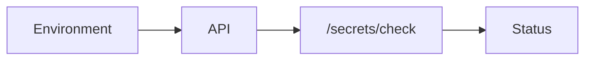

# Security and Secrets

<div class="grid chunk_summaries" markdown>

-   :material-shield-lock:{ .lg .middle } **Secrets**

    ---

    API keys for providers and DB credentials loaded from environment.

-   :material-account-key:{ .lg .middle } **Validation**

    ---

    `/secrets/check` verifies presence and connectivity.

-   :material-file-lock:{ .lg .middle } **Least Privilege**

    ---

    Restrict DB users and network access.

</div>

[Get started](index.md){ .md-button .md-button--primary }
[Configuration](configuration.md){ .md-button }
[API](api.md){ .md-button }

!!! tip "Separate Environments"
    Use different credentials per environment (dev, staging, prod). Never reuse production secrets locally.

!!! note ".env Hygiene"
    `.env` is for local dev only. In production, use a secret manager and inject env vars securely.

!!! warning "Transport Security"
    Terminate TLS in front of the API service. Restrict DB ports to private networks.

## Secrets Check

=== "Python"
```python
import httpx
print(httpx.get("http://localhost:8000/secrets/check").json())
```

=== "curl"
```bash
curl -sS http://localhost:8000/secrets/check | jq .
```

=== "TypeScript"
```typescript
async function secrets() {
  console.log(await (await fetch('/secrets/check')).json());
}
```

## Environment Keys (Selected)

| Key | Purpose |
|-----|---------|
| `OPENAI_API_KEY`, `VOYAGE_API_KEY`, `COHERE_API_KEY`, `JINA_API_KEY` | Provider access for embedding/gen/rerank |
| `POSTGRES_*` | DB connection for pgvector + FTS |
| `NEO4J_*` | Neo4j connection |
| `SERVER_PORT` | API service port |
| `CONFIG_FILE` | Path to `tribrid_config.json` |



!!! success "Audit"
    Log access to admin endpoints (`/config`, `/docker/*`, `/reranker/*`). Monitor for unusual patterns in logs and metrics.
