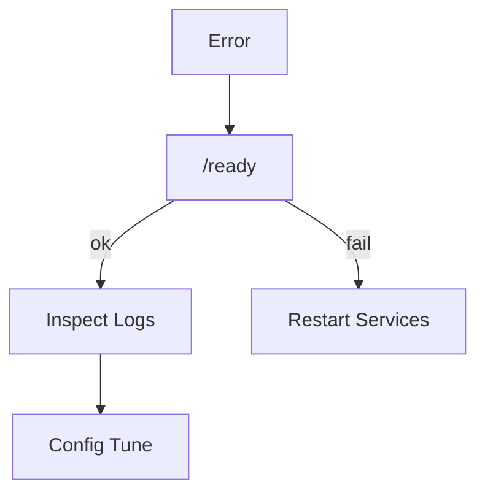

# Troubleshooting

<div class="grid chunk_summaries" markdown>

-   :material-bug:{ .lg .middle } **Common Failures**

    ---

    Timeouts, DB connectivity, schema mismatches.

-   :material-shield-alert:{ .lg .middle } **Validation Errors**

    ---

    Pydantic constraints fail fast with precise messages.

-   :material-ambulance:{ .lg .middle } **Recovery**

    ---

    Clear caches, reindex, restart services.

</div>

[Get started](index.md){ .md-button .md-button--primary }
[Configuration](configuration.md){ .md-button }
[API](api.md){ .md-button }

!!! tip "Read the Error"
    Pydantic tells you exactly which field failed validation and why. Fix the config, regenerate types if needed, and retry.

!!! note "Logs"
    Use `/docker/{container}/logs` and application logs to pinpoint failures. For DB errors, also inspect Postgres and Neo4j logs.

!!! warning "Data Loss Risk"
    Avoid deleting DB volumes unless you intend a full reset. Back up before destructive actions.

## Symptom → Action

| Symptom | Likely Cause | Action |
|---------|--------------|--------|
| 500 on `/search` | DB unavailable | Check `/ready`, restart DB containers |
| No results from graph | Neo4j empty or disconnected | Rebuild graph, check credentials |
| Validation error on `/config` | Field constraints violated | Adjust values to allowed ranges |
| Slow queries | High `max_hops`, large `top_k` | Reduce hops, tune indexes |



## Useful Commands

=== "Python"
```python
import httpx
print(httpx.get("http://localhost:8000/ready").json())  # readiness
```

=== "curl"
```bash
curl -sS http://localhost:8000/ready | jq .
curl -sS http://localhost:8000/docker/status | jq .
```

=== "TypeScript"
```typescript
await fetch('/ready').then(r => r.ok || Promise.reject('Not ready'))
```

- [x] Verify readiness
- [x] Inspect logs
- [x] Reduce search/fusion parameters
- [x] Reindex corpus

??? note "Cache Issues"
    If you suspect stale cache, clear retrieval caches (if enabled) or include a cache-busting parameter during debugging.
