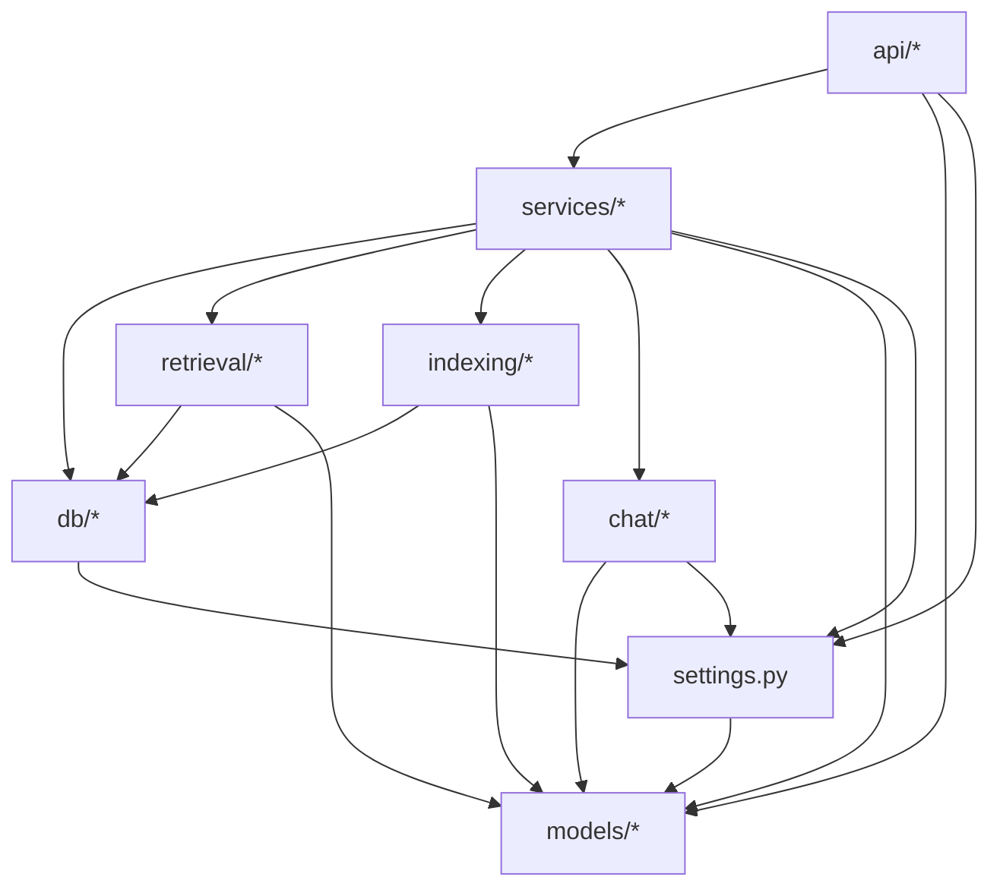

# TriBridRAG Backend Architecture (`server/`)

## The rule in one sentence
**Pydantic is the law.** All API payload shapes and all tunable runtime behavior are defined in Pydantic models first (especially `server/models/tribrid_config_model.py`).

## Canonical directory responsibilities

### `models/`
- **Source of truth** for API payload shapes and configuration models.
- If the frontend needs a type, it must exist as a Pydantic model and be included in TypeScript generation.

### `api/`
- FastAPI routers only.
- Routers accept/return Pydantic models (request + response models).
- Minimal logic: validation, error mapping, request scoping, call into services.

### `services/`
- Business logic and orchestration.
- Owns cross-cutting flows (e.g., RAG pipeline orchestration, config persistence, trace storage).

### `db/`
- Database clients for Postgres and Neo4j.
- Clients must be configured via Pydantic config/settings objects, not direct environment reads.

### `retrieval/` and `indexing/`
- Retrieval and indexing pipeline logic.
- No FastAPI concerns here (no request/response handling).

### `chat/`
- Provider routing and model discovery.
- Must not directly read environment variables (see env boundary below).

### `mcp/`
- MCP server + tools wiring.

### `observability/`
- Metrics, alerts, instrumentation.

## Single env boundary (required)
Environment variables are allowed **only** through a single Pydantic Settings boundary:

- `server/settings.py` is the only module allowed to access `os.environ` / `os.getenv` or to load `.env`.
- Every other module must consume a **Pydantic object** (e.g., `Settings`, `TriBridConfig`) via import or dependency injection.

Why: this prevents duplicated, inconsistent env logic across the codebase and keeps runtime behavior auditable.

## Allowed dependency directions (no cycles)

## Non-negotiable invariants (enforced by verifier)
- **No env reads outside `server/settings.py`.**
- **No `python-dotenv` loading outside `server/settings.py`.**
- API routers must return Pydantic models (no ad-hoc dict shapes drifting away from the spec).

