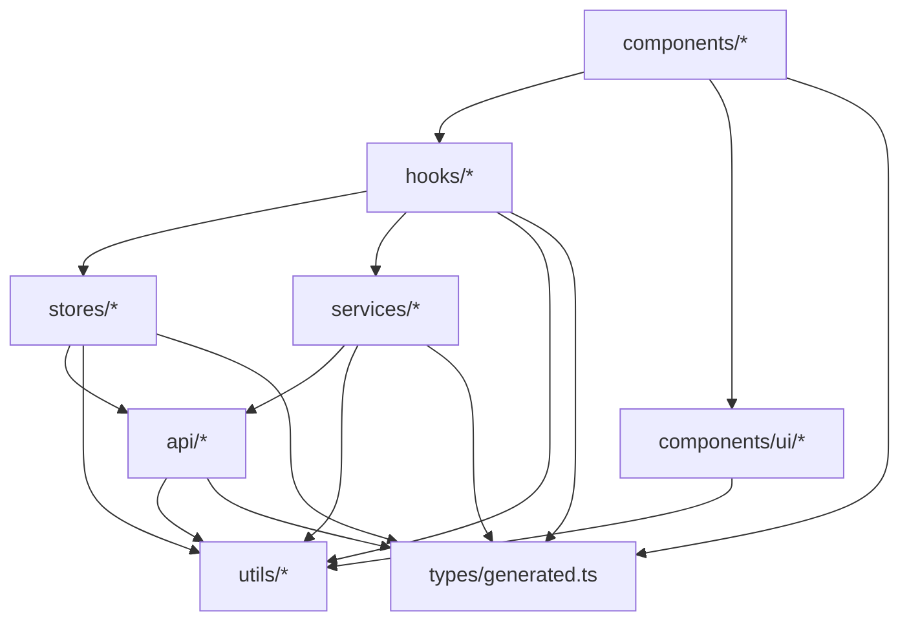

# TriBridRAG Frontend Architecture (`web/src/`)

## The rule in one sentence
**Pydantic is the law.** Frontend types come from `web/src/types/generated.ts` (generated from `server/models/tribrid_config_model.py`). Don’t hand-write API payload types.

## Canonical directory responsibilities

### `types/`
- **`types/generated.ts` is the source of truth** for API payload + config types.
- **Do not edit `generated.ts` by hand.** Regenerate via `uv run scripts/generate_types.py`.

### `api/`
- **All HTTP calls live here.**
- `api/client.ts` is the **single HTTP boundary** (axios instance + base URL handling).
- Other files under `api/*` are **feature API modules** (e.g. `docker.ts`, `config.ts`) that wrap endpoints and return `generated.ts` types.

### `services/`
- Service classes/functions orchestrate multi-step flows across one or more `api/*` modules.
- **Services must not reinvent HTTP base resolution** or introduce new HTTP clients.

### `stores/` (Zustand)
- Shared state, persistence, cross-tab state, derived selectors.
- Store types must come from `types/generated.ts` (when representing backend data).

### `hooks/`
- React hooks that bind stores/services to component-friendly APIs.
- Hooks can perform side effects (polling, subscriptions) but should **not** create new data models.

### `components/`
- React components only.
- Components should be “dumb” where possible: use hooks for data/state.

### `components/ui/` (primitives only)
This directory is for reusable, app-wide **UI primitives** (Button, ProgressBar, ErrorBoundary, TooltipIcon, etc.).

**Not allowed here:** feature components with domain semantics (Repo selector, terminal, model picker, storage calculator). Those belong under a feature directory (e.g. `components/RAG/`, `components/LiveTerminal/`).

### `pages/`
- Route-level wrappers only (if needed): layout, error boundaries, and composition of feature tabs.
- Prefer keeping route logic centralized in `config/routes.ts`.

### `utils/`
- Pure helpers (formatting, error helpers, small DOM helpers).
- Must remain **side-effect free** where possible and must not depend on React state management.

### `styles/`
- CSS and design tokens. Prefer using shared tokens (`styles/tokens.css`) and app-level styles rather than per-feature ad-hoc styling.

### `contexts/` (deprecated)
The project uses Zustand for shared state. React Context should be used only for true React-provider concerns (rare).

If `contexts/` still exists, treat it as **legacy** and do not add new contexts unless there’s a strong reason.

## Allowed dependency directions (no cycles)

## Non-negotiable invariants (enforced by verifier)
- **One HTTP boundary**: no ad-hoc `fetch('/api/...')` outside `api/*`.
- **No `import.meta.env` for API base URL**. Frontend talks to the backend via relative `/api` (Vite proxy in dev; same-origin in prod).
- **No imports from `modules/_archived/*`** in app code.
- **No legacy `window.*` globals** in TS/TSX.

## Routing and subtabs
- Main routing is defined in `config/routes.ts` (and rendered by the navigation components).
- Subtabs should be **URL-first** via `?subtab=` for deep-linking and reload safety.

